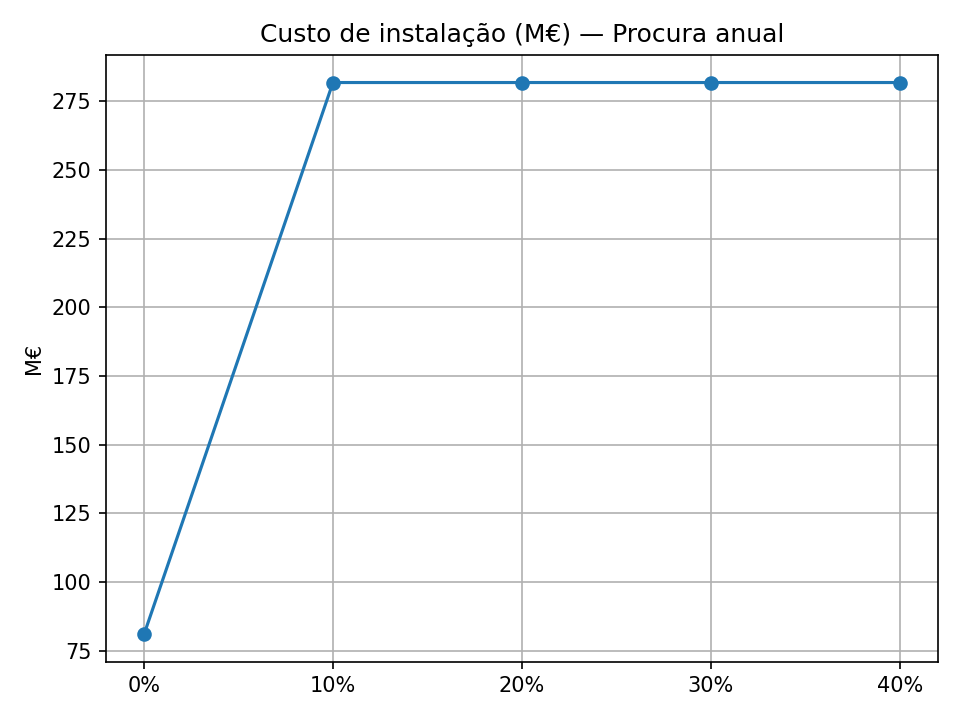

# Green Hydrogen Supply Chain Optimization

Mixed integer optimization for the design and operation of a green hydrogen network across Portugal's 18 mainland districts. The project combines facility location, renewable energy allocation, inventory, hydrogen distribution and trailer capacity over the 2030, 2040 and 2050 planning periods.

Developed as a group project for **Supply Chain Management, MSc in Engineering and Management, Instituto Superior Técnico (2025/2026)**. The implementation uses **Python, PuLP and the open source CBC solver**.

## The decision problem

Where should production plants and storage facilities be built, which sizes should be selected, and how should energy and hydrogen move through the network as demand penetration increases?

The objective minimizes capital investment, production and storage operating costs, hydrogen transport, electricity consumption and transmission, and trailer costs. Constraints connect electrolysis energy requirements to production, enforce facility capacities and storage balances, and meet a minimum fraction of demand in every district.

| Component | Model 1: `ghsc.py` | Model 2: `multigsch.py` |
| --- | --- | --- |
| Facility investment | Fixed network, built initially | Facilities can open in any planning period |
| Availability after opening | Available throughout the horizon | Availability persists in later periods |
| Electricity price | District price derived from renewable availability | Uniform electricity price |
| Operations | Production, inventory, energy transfers and distribution by period | Same categories of operational decisions |
| Capital expenditure | Charged once for selected facilities | Charged in the opening period |

These formulations change both investment timing and electricity pricing. Their objective values are therefore scenario comparisons, rather than an isolated estimate of the benefit of phased construction.

## Run the models

Use Python 3.10 or newer. From the repository root:

```bash
python -m venv .venv
source .venv/bin/activate  # Windows: .venv\Scripts\activate
python -m pip install -r requirements.txt
python ghsc.py
python multigsch.py
```

The PuLP CBC backend must be available in your environment. The scripts print solver status, the total objective, selected facilities, cost components and operational results to the console. Model runs can take several minutes; hardware, solver version and parameters affect runtime.

To save new console output:

```bash
mkdir -p results/local
python ghsc.py > results/local/model1.txt
python multigsch.py > results/local/model2.txt
```

Edit `config.py` to change the planning periods, minimum demand penetration, transport rates, process energy intensity, trailer assumptions, operating costs or electricity prices. `data.py` contains the district and facility inputs already present in the original public repository; see [data provenance](docs/data-provenance.md).

## Sensitivity analysis

```bash
MPLBACKEND=Agg python ghsc_sensitivity_dashboard.py
```

The runner solves 15 Model 1 scenarios: four hydrogen transport rates, six renewable availability changes and five demand changes. It writes a CSV and individual charts to `ghsc_sensitivity/`. The historical `Sensitivity.py` command is retained as a compatibility entry point to this runner.

## Archived project results

The completed project includes archived solver outputs and a sensitivity CSV. These are **historical results**, not a claim that every value is reproduced by the current configuration.

| Archived run | Solver status recorded | Objective | Capital expenditure |
| --- | --- | --- | --- |
| Model 1 | Optimal | €1,211,893,128.92 | €81,000,000 |
| Model 2 | Optimal | €2,085,637,615.47 | €56,000,000 |

Model 1's archive selects small production plants in Coimbra and Viseu, and type 1 storage in Portalegre and Vila Real. Model 2's archive selects small production plants in Évora and Setúbal and type 1 storage in Beja; **all selected facilities open in 2030 in that run**, despite the formulation allowing later openings.

The archived sensitivity experiment reports an increase in Model 1's objective from €1,211.89 million to €1,646.00 million as demand rises by 40%. Selected investment increases from €81.0 million to €281.8 million at the first +10% demand scenario. Source values and selected original plots are in [`results/archived-course-run/`](results/archived-course-run/).



*Original project chart: investment cost in millions of euros against percentage demand growth.*

See [the project summary](docs/project-summary.md) for the economic interpretation and [model assumptions and limitations](docs/model-notes.md) before using these results.

Both formulations and the sensitivity runner have passed small synthetic-case checks for optimal solver status, constraint feasibility, integer variables and demand penetration. See [validation scope](docs/validation.md).

## Repository contents

```text
ghsc.py                         Model 1: static facility investment
multigsch.py                    Model 2: time-indexed facility openings
config.py                       Scenario and operating assumptions
data.py                         District and facility parameters
ghsc_sensitivity_dashboard.py   Model 1 scenario analysis and charts
Sensitivity.py                  Compatibility entry point
docs/                           Methodology, interpretation and provenance
results/archived-course-run/    Original result logs, sensitivity CSV and plots
```

Older root-level `.txt` outputs are retained for continuity with the original repository. They may reflect earlier configurations; the explicitly labelled archive above corresponds to the final local submission files.

## Authors

**Margarida Sismeiro, João Filipe, Giovana Colnaghi, Marta Lourenço and Francisco Dias** - Group 17. The source submission does not record individual task ownership, so the project is presented as shared group work.

Course handouts, classmates' solutions, assessment materials, submission links, video files and student numbers are excluded from the portfolio additions. No new license is assigned to shared work or course inputs.
